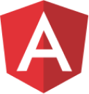

<h1 align="left" id="macropower-title">:wave: ¡Hola! Mi nombre es Juan Gabriel Tavárez</h1>
<h3 align="left">Soy un Desarrollador de Software Fullstack de República Dominicana 🇩🇴</h3>

 

- :speech_balloon: &nbsp;Soy un ex programador competitivo de ACM ICPC y desarrollador de software Full Stack con más de 4 años de experiencia en el desarrollo de soluciones multiplataforma (aplicaciones web y móviles). Dispuesto a participar en cualquiera de las etapas de desarrollo de software, trabajando con metodologías ágiles. Enfocado en entregar la mejor experiencia de usuario posible, seguido de mejores prácticas, patrones de diseño y código optimizado.
- :computer: &nbsp;Contáctame por **[Email](mailto:juangabriel2960@gmail.com)**
- :computer: &nbsp;Conéctate conmigo en **[LinkedIn](https://www.linkedin.com/in/jgtavarez/)**

 

<h2 align="left" id="macropower-tech">Tecnologías favoritas</h2>

> Herramientas, lenguajes y otros recursos con las que me gusta trabajar.

<table>
  <tr>
  <td align="center" width="96">
      
       TypeScript
    </td>
    <td align="center" width="96">
      
       JavaScript
    </td>
    <td align="center" width="96">
      
       Node.js
    </td>
    <td align="center" width="96">
      
       React
    </td>
    <td align="center" width="96">
      
       Next.js
    </td>
    <td align="center" width="96">
      
       Angular
    </td>
     <td align="center" width="96">
      
       Nest.js
    </td>
    <td align="center" width="96">
      
       GraphQL
    </td>
    <td align="center" width="96">
      
       HTML
    </td>
  </tr>
  <tr>
    <td align="center" width="96">
      
       CSS
    </td>
    <td align="center" width="96">
      
       Tailwind
    </td>
    <td align="center" width="96">
      
       PostgreSQL
    </td>
    <td align="center" width="96">
      
       MongoDB
    </td>
    <td align="center" width="96">
      
       AWS
    </td>
    <td align="center" width="96">
      
       GCP
    </td>
    <td align="center" width="96">
      
       Native
    </td>
   <td align="center" width="96">
      
       Go
    </td>
    <td align="center" width="96">
      
       Express
    </td>
  </tr>
</table>